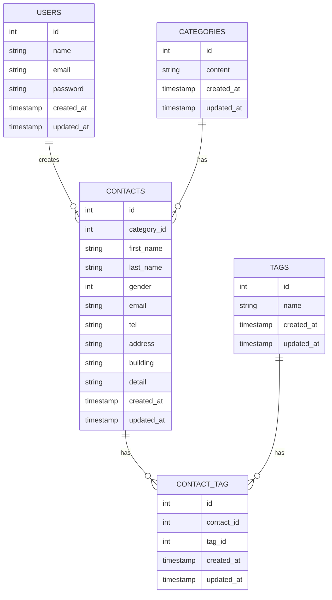

# COACHTECH お問い合わせフォーム

## 概要
お問い合わせフォーム機能と管理画面を備えたLaravelアプリケーション

お客様からのお問い合わせを受け付け、管理者が一元管理できるシステムです。

## ER図



## 環境構築手順

### 前提条件
- Docker がインストール済み
- Git がインストール済み

### セットアップ手順

```bash
# リポジトリをクローン
git clone https://github.com/sae0715/contact-form-app.git
cd contact-form-app

# Sailを起動
./vendor/bin/sail up -d

# 依存パッケージをインストール
sail composer install
sail npm install

# データベースを初期化
sail artisan migrate:fresh --seed

# 開発サーバーを起動
sail npm run dev
```

## 使用技術
- Laravel 10.50.2
- PHP 8.5.5
- MySQL 8.0
- Fortify（認証）
- Tailwind CSS
- Docker

## APIエンドポイント一覧

| メソッド | エンドポイント | 説明 | ステータス |
|---------|--------------|------|----------|
| GET | / | お問い合わせフォーム表示 |
| POST | /contacts/confirm | お問い合わせ確認 |
| POST | /contacts | お問い合わせ送信 |
| GET | /thanks | 送信完了画面 |
| GET | /register | 管理者登録画面 |
| POST | /register | 管理者登録 |
| GET | /login | ログイン画面 |
| POST | /login | ログイン |
| POST | /logout | ログアウト |
| GET | /admin | 管理画面 |

## 開発環境URL
- リポジトリ：https://github.com/sae0715/contact-form-app.git
- アプリケーション：http://localhost
- phpMyAdmin：http://localhost:8080

## アクセス方法

### ユーザー側
1. http://localhost にアクセス
2. フォームにお問い合わせ内容を入力
3. 確認ページで内容を確認
4. 「送信」ボタンをクリック
5. 送信完了画面が表示される

### 管理者側
1. http://localhost/register にアクセス
2. メールアドレスとパスワードを入力して登録
3. http://localhost/login からログイン
4. 管理画面でお問い合わせ一覧を確認

## テストアカウント

メール：test@example.com
パスワード：password

## トラブルシューティング

### アプリが起動しない場合

```bash
sail artisan config:clear
sail artisan cache:clear
sail down
sail up -d
```

### M1/M2/M3 Mac で「no matching manifest」エラーが出た場合

compose.yaml を開き、mysql サービスに以下を追加：

```yaml
mysql:
    image: 'mysql/mysql-server:8.0'
    platform: 'linux/amd64'
```

## 作成者
稲嶺